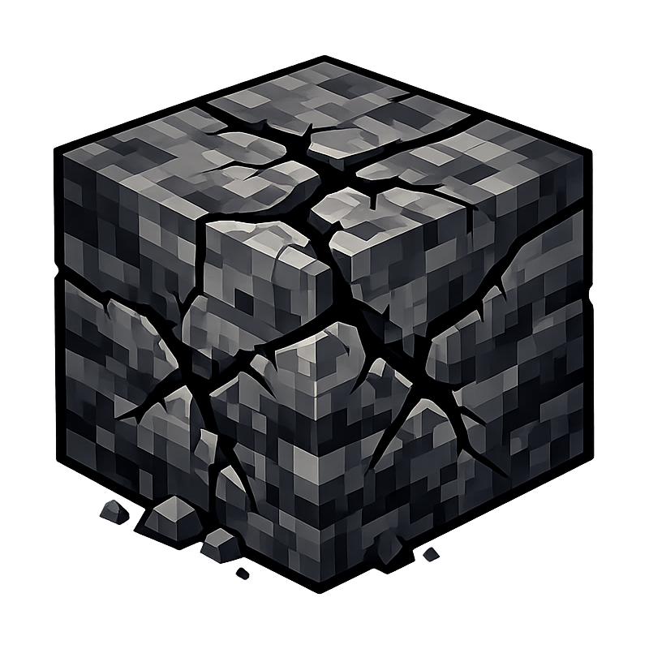

# Mining Hardness

Makes mining progressively harder based on **depth** and **enclosure** — the deeper and more buried a block is, the harder it is to mine.

Blocks near the surface or exposed to open air mine normally. Blocks deep underground and surrounded by solid blocks can become up to 16x harder with default settings.

The intent is to make mining a more strategic activity — the deeper you go, the more incentivized you are to explore caves instead of digging through solid rock.

> **Note:** The mod must be installed on both the client and server. Configure it on the server — those settings are synced to each client automatically, so client config files don't need to match.

## Features

- **Mining speed**: Blocks take longer to break based on depth and enclosure
- **Hunger**: Mining harder blocks causes more exhaustion
- **Tool durability**: Tools take more damage on harder blocks
- **Enclosure detection**: Scans a 5x5x5 area around each block, weighting closer blocks more heavily
- **Dimension support**: Works in the Overworld and Nether (other dimensions unaffected)
- **Soft cap**: Prevents blocks from becoming impossibly hard (caps excess hardness above a threshold)
- **Block whitelist/blacklist**: Target or exclude specific blocks using regex patterns

## How it works

Two factors determine the hardness multiplier:

1. **Depth factor** (0–1): Linear interpolation between sea level and bedrock. In the Nether, max depth factor is always applied.

2. **Enclosure** (0–1): How surrounded a block is by solid blocks in a 5x5x5 area. The raw value is raised to an exponent (default 8) so low enclosure has almost no effect while high enclosure ramps up steeply.

The core multiplier is: `1 + enclosure.maxBonus * enclosure^exponent * depthFactor`.

With defaults (`enclosure.maxBonus=15`, `enclosure.exponent=8`), depth alone doesn't increase hardness — it gates the enclosure effect. A fully enclosed block at max depth gets 16x hardness; the same block floating in the air stays at 1x.

An optional `depth.maxBonus` (default 0) adds a separate depth-based multiplier on top: `(1 + depthFactor * depth.maxBonus)`.

## Configuration

Config file: `config/mininghardness-server.toml` (auto-generated on first run).

| Setting | Default | Description |
|---|---|---|
| `depth.startY` | `62` | Y level where difficulty begins increasing |
| `depth.endY` | `-64` | Y level where depth factor reaches maximum |
| `depth.maxBonus` | `0.0` | Extra multiplier from depth alone (0 = depth only gates enclosure) |
| `enclosure.exponent` | `8.0` | Steepness of enclosure scaling (higher = sharper curve) |
| `enclosure.maxBonus` | `15.0` | Max multiplier bonus when fully enclosed at max depth |
| `nether.startY` | `128` | Nether start Y (set equal to endY for constant max depth) |
| `nether.endY` | `128` | Nether end Y |
| `softCap.threshold` | `50` | Hardness above which the soft cap kicks in (obsidian = 50) |
| `softCap.multiplier` | `0.2` | Reduction factor for hardness above the soft cap |
| `effects.toolDamageMultiplier` | `1.0` | How much tool damage scales with hardness (0 = vanilla) |
| `effects.exhaustionMultiplier` | `2.0` | How much exhaustion scales with hardness (0 = vanilla) |
| `scope.blockWhitelist` | `""` | Regex of block IDs to affect (empty = all blocks) |
| `scope.blockBlacklist` | `""` | Regex of block IDs to exclude (also excluded from enclosure scan) |
| `scope.exemptMultiplier` | `0.0` | Effect factor for blocks excluded by white-/blacklist (0 = unaffected, 1 = fully affected) |

### Whitelist/blacklist tips

- Patterns match against the block's path (e.g. `stone`), unless the pattern contains `:`, in which case it matches the full ID (e.g. `minecraft:stone`).
- Example whitelist: `stone|deepslate|andesite|calcite|diorite|granite|tuff` to only affect common cave blocks.
- Example blacklist: `.*_ore` to exclude all ores.
- Blacklisted blocks are not counted as solid in enclosure scans, so they don't make neighboring blocks harder.
